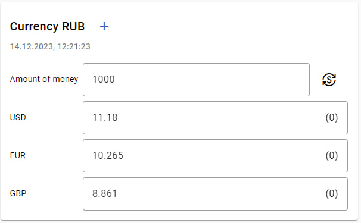
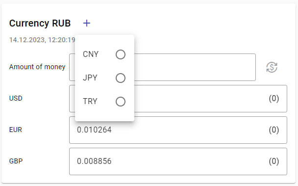

# Currency Converter
This project was generated with [Angular CLI](https://github.com/angular/angular-cli) version 16.1.0.

## Development server
Run `ng serve` for a dev server. Navigate to `http://localhost:4200/`.

## Tools
- [Angular Material](https://material.angular.io/) version 16.1.1 
- [Currency Data API](https://apilayer.com/marketplace/currency_data-api), if no data is received, it means that the number of requests has exceeded the maximum and you need to change the key

## Site
- [Currency converter](https://pojerman.github.io/currency-converter/) GitHub Pages
- [Currency converter](https://stackblitz.com/edit/kkky4x?file=README.md) StackBlitz

## Screen

Currency Converter

Add value

